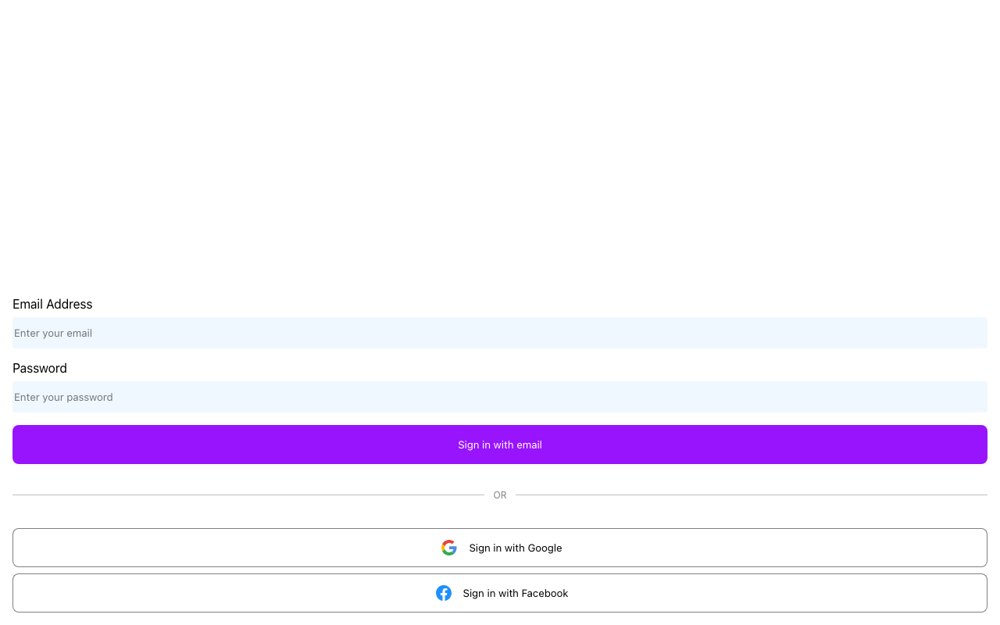

# 🏐 Volley App

A map-based app for finding and organizing volleyball games/courts, with user accounts.



## Features

- 🗺️ **Interactive map** — Google Maps view (`@react-google-maps/api`) with volleyball-icon markers pulled from Firestore
- 🔐 **Authentication** — email/password auth with login, sign-up, and protected routes (`Auth/`, `ProtectedRoute`)
- 👤 **User profiles** — a `/praktisk` profile page for account details
- 🔥 **Firebase-backed** — Firestore for data and Firebase Storage for assets
- 📱 **PWA-ready** — ships with Workbox service worker packages for offline/installable support

## Installation

```bash
git clone <this repo>
cd volley-app
npm install
```

You'll need Firebase project credentials configured — see [Environment variables](#environment-variables) below.

## Usage

```bash
npm start
```

Then open [http://localhost:3000](http://localhost:3000). `/` is the home feed (requires login), `/map` shows nearby games/courts, `/login` and `/signup` handle auth.

## Environment variables

Copy `.env.example` to `.env` and fill in each value from your Firebase project's web app config:

- `REACT_APP_FIREBASE_KEY` — Firebase Web API key
- `REACT_APP_FIREBASE_DOMAIN` — Firebase Auth domain (e.g. `your-project.firebaseapp.com`)
- `REACT_APP_FIREBASE_PROJECT_ID` — Firebase project ID
- `REACT_APP_FIREBASE_STORAGE_BUCKET` — Firebase Storage bucket (e.g. `your-project.appspot.com`)
- `REACT_APP_FIREBASE_SENDER_ID` — Firebase Cloud Messaging sender ID
- `REACT_APP_MESSAGING_APP_ID` — Firebase app ID
- `REACT_APP_MEASSUREMENT_ID` — Firebase Analytics measurement ID (note: this is the actual variable name used in code, misspelling included)

Note: the Google Maps API key used by the `/map` page (`src/Pages/Map.js`) is currently hardcoded in source rather than read from an environment variable — it isn't included above since it's not a `.env`-driven setting, but should probably be moved to one before this app is deployed anywhere public.

Without valid Firebase values, the app still builds and starts, but auth/data features (sign-in, map data) won't work.

## Built with

- [React](https://reactjs.org/) 18 (Create React App)
- React Router
- Firebase (Auth, Firestore, Storage)
- Google Maps JavaScript API

## Status

🔧 Was broken — `npm install` failed with an ERESOLVE conflict because the unused, dead dependency `react-google-maps@9.4.5` (only peer-compatible with React 15/16) clashed with `react@18`; the app actually uses the modern `@react-google-maps/api` instead, so `react-google-maps` was removed from `package.json`. Also hit a known CRA5/ESLint 8.57 incompatibility (`eslint-plugin-jest` crashes with "Cannot read properties of undefined (reading 'Any')"); worked around with `DISABLE_ESLINT_PLUGIN=true npm run build`. With those in place, `npm install && DISABLE_ESLINT_PLUGIN=true npm run build` verified working as of 2026-09-03 (no Firebase credentials needed for a build). Functional prototype — core map, auth, and data flows are wired up, but there's no test coverage beyond the CRA defaults and no CI/deployment config checked in.
